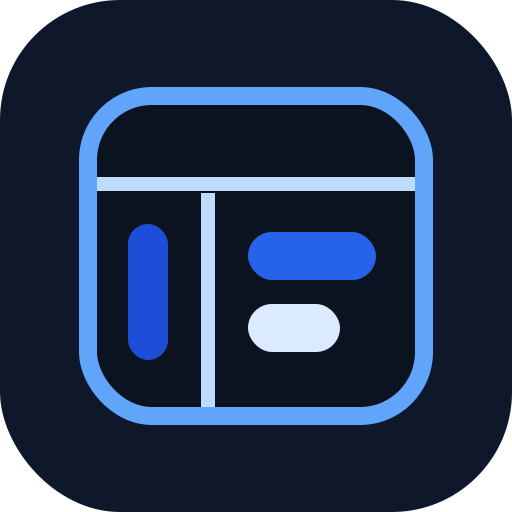
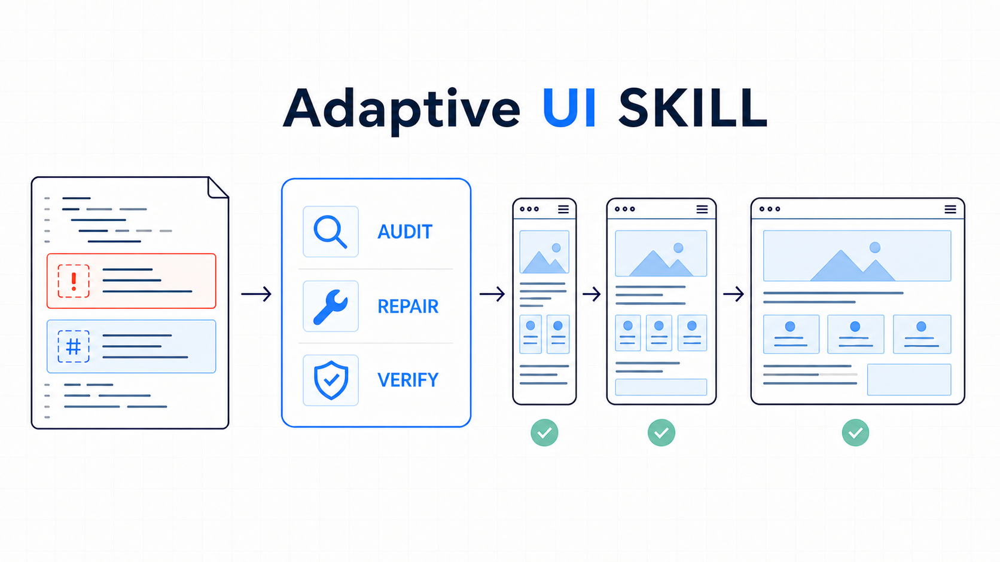

<p align="center">
  
</p>

# AdaptiveUI-SKILL

**用于审计、实现和验证可靠响应式 Web 界面的两个仅显式调用的可移植 Agent Skill。**

[English](README.en.md) · [Agent Skills 规范](https://agentskills.io/specification) · [Apache-2.0](LICENSE) · [免责声明](DISCLAIMER.zh-CN.md)

AdaptiveUI-SKILL 将 UI 适配从“多写几个断点”升级为有证据的工程流程。它覆盖布局重排、横向溢出、视口单位、语义圆角体系、键盘与触摸交互、无障碍偏好、跨浏览器回退和不必要的 JavaScript 复杂度。它不会为每一种物理分辨率单独生成页面，也不会用全局裁切掩盖问题。

<p align="center">
  
</p>

<p align="center"><sub>审计证据，修复根因，验证可靠重排。</sub></p>

仓库包含两个框架无关、相互配合的 Agent Skill，以及一层轻量 Codex Plugin 封装。Skill 始终是工作流的唯一事实来源：`AdaptiveUI-S` 是标准工作流，`AdaptiveUI-N` 则增加一次必做、且有范围限制的改动后样式审查。

## 为什么需要它

许多所谓“通用适配基座”会把正确的基础能力和有害的全局补丁混在一起：

- `overflow-x: hidden` 会隐藏真正越界的元素，并可能裁掉焦点或抽屉；
- 给所有链接统一加 44px 尺寸和内边距会破坏行内文本；
- `pre, code { white-space: pre-wrap }` 会改变代码展示语义；
- `iframe { height: auto }` 不能建立可靠的嵌入比例；
- 增加设备断点不能弥补缺失的内在尺寸布局；
- 静态扫描不能证明浏览器行为或 WCAG 合规。

本 Skill 用根因诊断、受限修改和明确验证证据替代这些捷径。

## 核心能力

- `AdaptiveUI-S`：标准的只读审计、实施修改和验证；也支持在断续工作结束后由用户显式要求的最终审查。
- `AdaptiveUI-N`：完成 UI 实现后，强制审查本任务改动的文件及其直接相关样式。
- 仅显式调用：已安装、任务内容匹配，或同一对话里曾经调用，都不会让任一 Skill 在后续消息自动启用。
- 适配 UI 相关性门控：显式调用后，即使请求只描述产品功能，Skill 也会主动推导属于适配范围的 UI 影响；纯装饰、纯文案和无关的非 UI 信息不能改变或扩大该范围。
- 检查容器、Grid、Flex、内在尺寸、溢出、缩放、媒体、表格和视口行为。
- 当请求明确涉及组件圆角一致性时，提供可选的视觉层级建议；优先保留已有设计令牌。
- 检查键盘、焦点、导航、目标尺寸、动画偏好、强制颜色和文字间距。
- 简化 JavaScript：移除视口驱动尺寸、滚动劫持、重复渲染、自动播放、过期监听和冗余状态。
- 适配 Vanilla、React/Next、Vue/Nuxt、SvelteKit、Tailwind、Scoped CSS、CSS Modules、预处理器和 CSS-in-JS。
- 提供零第三方依赖的 Python 审计器，包含稳定规则编号、置信度、豁免、JSON 输出和 CI 阈值。
- 提供仅使用标准库、失败时静默降级的更新调度器，保存绝对下次检查时间并在任务后给出详细提醒；不会自动更新。
- 宿主已有浏览器能力时进行运行时验证，但不强制安装 Playwright。
- 网页预览编码验证会分别检查源码 UTF-8、HTML 声明、HTTP `Content-Type` 和浏览器实际采用的 `document.characterSet`。

## 目录结构

```text
.agents/plugins/marketplace.json
plugins/adaptiveui-skill/
├── .codex-plugin/plugin.json
├── assets/
├── hooks/hooks.json
└── skills/
    ├── adaptiveui-s/
    │   ├── SKILL.md
    │   ├── agents/openai.yaml
    │   ├── release.json
    │   ├── scripts/
    │   │   ├── audit_ui.py
    │   │   └── check_update.py
    │   ├── references/
    │   └── assets/
    └── adaptiveui-n/
        ├── SKILL.md
        └── agents/openai.yaml
tests/
```

面向人的项目说明放在仓库根目录；`AdaptiveUI-N` 有意复用同级 `adaptiveui-s` 中的审计器、更新调度器、发布元数据和引用资料，因此两个目录构成一个安装包。

## 安装

### 通用 Agent Skills 客户端

按照客户端支持的 Skill 安装方式复制或安装以下两个目录，并保持它们为同级目录：

```text
plugins/adaptiveui-skill/skills/adaptiveui-s
plugins/adaptiveui-skill/skills/adaptiveui-n
```

对于扫描 `$HOME/.agents/skills` 的客户端，可将两个目录复制到该位置。不要只安装 `adaptiveui-n`。

PowerShell：

```powershell
Copy-Item -Recurse -Force `
  .\plugins\adaptiveui-skill\skills\adaptiveui-s `
  "$HOME\.agents\skills\adaptiveui-s"
Copy-Item -Recurse -Force `
  .\plugins\adaptiveui-skill\skills\adaptiveui-n `
  "$HOME\.agents\skills\adaptiveui-n"
```

macOS/Linux：

```sh
cp -R plugins/adaptiveui-skill/skills/adaptiveui-s \
  "$HOME/.agents/skills/adaptiveui-s"
cp -R plugins/adaptiveui-skill/skills/adaptiveui-n \
  "$HOME/.agents/skills/adaptiveui-n"
```

不同客户端的发现和调用方式可能不同。客户端可以仅通过 `SKILL.md` 发现 Skill；手动安装时，必须让 `adaptiveui-s` 与 `adaptiveui-n` 保持在同级，N 才能找到 S 内随附的审计器、引用资料和资源；缺少这个同级审计器时，N 不得声称已完成增强流程；`agents/openai.yaml` 是可选的 Codex 展示扩展。

### 仓库发布后的 Codex Plugin 安装

```text
codex plugin marketplace add ksukie/AdaptiveUI-SKILL
codex plugin add adaptiveui-skill@adaptiveui-skill
```

本地开发时，先把仓库绝对路径添加为非默认 marketplace，再安装相同插件名。安装或更新后新建任务，使 Codex 重新发现 Skill。

本插件不增加 MCP、连接器或服务凭据。它只随附一个 `UserPromptSubmit` Hook，用于在当前消息显式调用 S 或 N 时运行限频更新调度器。Codex 会要求用户先审查并信任插件 Hook；Marketplace 安装仍可能遵循宿主的常规身份验证策略。

## 更新

按旧版的获取方式选择对应的更新路径。下载的 ZIP 或手动复制的 Skill 不会自行更新。

| 旧版来源 | 更新方式 |
| --- | --- |
| Git 克隆的仓库 | 在仓库目录执行 `git pull --ff-only origin main`。若 Git 提示工作区不干净，先保留或提交本地改动。 |
| 下载 ZIP 或手动复制 | 下载或复制当前版本，再替换两个同级目录：`plugins/adaptiveui-skill/skills/adaptiveui-s` 和 `plugins/adaptiveui-skill/skills/adaptiveui-n`；不要只替换 `SKILL.md`。 |
| Codex Plugin marketplace | 刷新 marketplace、移除缓存中的旧插件、重新安装，然后新建 Codex 任务。 |

通过此 marketplace 安装的 Codex Plugin 可执行：

```text
codex plugin marketplace upgrade adaptiveui-skill
codex plugin remove adaptiveui-skill@adaptiveui-skill
codex plugin add adaptiveui-skill@adaptiveui-skill
```

若尚未添加该 marketplace，先执行 `codex plugin marketplace add ksukie/AdaptiveUI-SKILL`，再安装插件。

### 可选更新提醒

每次显式调用 S 或 N 时，都可以运行一个不阻塞主要任务的更新调度器。第一次仓库检查最早发生在本地版本正式发布时间的 72 小时后。若成功检查且没有新版本，下次检查安排在 72 小时后；若发现较新的稳定版本，则先完成当前任务，再报告本地与最新版本、发布时间、后续稳定版本数量、最新版双语摘要、前次/本次/下次检查时间和更新说明。第一次后续提醒安排在 36 小时后；只要本地仍落后，后续每次成功确认都会将上一次间隔缩短 20%，最低为 12 小时。

`next_check_at` 表示“最早允许检查的时间”，不是后台定时器。若届时没有再次使用 Skill，检查会在下一次更晚的显式调用中执行，后续预约以那次实际检查时间为基准。请求失败不等同于“没有新版本”，不会缩短提醒间隔，并会在 12 小时后静默重试。

Codex Plugin 将调度状态保存在插件专用可写数据目录；手动复制的 Skill 会在可写时使用当前平台的用户状态目录。检查器只向固定的 Raw 发布元数据地址发送有大小限制的 HTTPS GET，不发送提示词、源码、项目路径、凭据或稳定用户标识。它不会自动更新任何文件，也不会阻塞用户要求的 UI 任务。设置 `ADAPTIVE_UI_UPDATE_CHECK=0` 或明确要求跳过检查即可关闭。

### v2.0.0 迁移

v2.0.0 将项目、插件、两个 Skill 及其调用标识统一迁移到 `AdaptiveUI-SKILL` 命名。这是一次破坏性更名；旧安装不会自动变成新插件，手动复制的旧 Skill 目录也不应与新目录并存。

| 项目 | v1.1.0 及以前 | v2.0.0 |
| --- | --- | --- |
| 仓库 | `ksukie/adaptive-ui-engineer` | `ksukie/AdaptiveUI-SKILL` |
| Codex Plugin | `adaptive-ui-engineer@adaptive-ui-engineer` | `adaptiveui-skill@adaptiveui-skill` |
| 标准 Skill | `Adaptive-UI-S` / `$adaptive-ui-s` | `AdaptiveUI-S` / `$adaptiveui-s` |
| 增强 Skill | `Adaptive-UI-N` / `$adaptive-ui-n` | `AdaptiveUI-N` / `$adaptiveui-n` |
| 配置文件 | `.adaptive-ui-engineer.json` | `.adaptiveui-skill.json` |

Codex 用户应移除旧插件、添加新的 marketplace 地址并安装新插件。手动安装用户应删除旧的 `adaptive-ui-s`、`adaptive-ui-n` 目录，再复制新的 `adaptiveui-s`、`adaptiveui-n` 目录。旧版迁移历史仍保留在 [CHANGELOG.md](CHANGELOG.md)。

## 显式调用与模式

在 Codex 中选择其中一个随附 Skill 标签：`@AdaptiveUI-S` 或 `@AdaptiveUI-N`；在文本客户端中，于当前消息写入 `$adaptiveui-s` 或 `$adaptiveui-n`。某些宿主也可能显示 `AdaptiveUI-SKILL` 插件父级；它只是容器而非第三种工作流，需要区分工作流时请选择 S 或 N。

| Skill | 适用场景 | 完成行为 |
| --- | --- | --- |
| `AdaptiveUI-S` | 标准响应式 UI 审计、普通实现、重构，以及断续工作结束后由用户显式要求的最终审查；请求可以只描述产品功能。 | 只推导属于适配范围的 UI 影响，不会自动增加最终审查。 |
| `AdaptiveUI-N` | 产品实现、修复或重构，其中推导出的适配 UI 改动必须包含最终审查。 | 只实现属于适配范围的 UI 影响，并审查本任务中所有影响 UI 的改动及直接相关样式。 |

两个 Skill 都声明为仅显式调用。在 Codex 中，`allow_implicit_invocation: false` 会阻止按提示内容隐式调用；Skill 指令也禁止将此前调用延续到后续消息。当前消息只要有效显式调用，就会启动相关性门控，不要求其余提示词出现“UI”。角色、状态、内容长度、目标用户和支持平台只有在形成具体用户可见影响时才约束适配 UI；纯文案、纯错字、没有适配后果的纯装饰改动，以及无关的数据库、服务端、部署和基础设施选择均在范围外。该划分既不取消、也不自动授权更广的工作：同一消息明确提出的更广工作可按其他适用指令处理，背景信息或 Skill 调用本身不构成授权。每次安装或更新后，都应在新对话中验证逐消息契约：先调用一次 S 或 N，再发送一条不含 `@` 或 `$` 的匹配 UI 请求，确认没有隐式使用 Skill。同时显式指名两者时，只读请求由 S 负责，实施请求由 N 负责。

需要查看标准对比和调用示例时，可查阅随插件提供的[模式选择说明](plugins/adaptiveui-skill/skills/adaptiveui-s/references/mode-selection.md)。仅询问模式区别不会激活任一工作流，也不会授权项目操作。

示例：

```text
使用 $adaptiveui-s 审计这个页面的响应式和无障碍问题，只读，不修改文件。
```

```text
使用 $adaptiveui-s 审查已完成的结账任务所改文件及直接相关样式，只读，不修改文件。
```

```text
使用 $adaptiveui-n 统一卡片圆角层级，并移除由视口宽度驱动的布局 JavaScript，之后完成必做的改动后样式审查。
```

```text
使用 $adaptiveui-n 为工作区增加成员邀请功能，并支持所有者、编辑者和查看者角色。
```

最后一条提示词没有提到 UI，N 仍会主动推导并实现邀请入口、表单、角色控件、反馈状态和响应式行为。存储与发送方式仍在 AdaptiveUI 范围之外，除非它们形成具体的用户可见约束。

如果只调用 N 却明确要求只读，N 会在检查项目之前停止，并要求用户在当前消息显式调用 S；N 不会静默启用 S。

## 静态审计器

除非显式提供 `--output`，审计器始终只读。若 Windows 中未注册 `python` 命令，请以 `py -3` 替代。

```text
python plugins/adaptiveui-skill/skills/adaptiveui-s/scripts/audit_ui.py <target>
  [--format text|json]
  [--config <file>]
  [--fail-on P0|P1|P2|P3|none]
  [--absolute-paths]
  [--redact-evidence]
  [--output <file>]
```

示例：

```text
python plugins/adaptiveui-skill/skills/adaptiveui-s/scripts/audit_ui.py ./src --format text --fail-on none
python plugins/adaptiveui-skill/skills/adaptiveui-s/scripts/audit_ui.py ./src --format json --fail-on P1
python plugins/adaptiveui-skill/skills/adaptiveui-s/scripts/audit_ui.py ./src --format json --redact-evidence --output audit.json
```

退出码：

| 代码 | 含义 |
| ---: | --- |
| 0 | 扫描完成，未触发所选失败阈值 |
| 1 | 扫描完成，存在达到阈值的发现 |
| 2 | 输入、配置或输出操作无效 |

JSON 固定使用 `schema_version: 3`。每条发现包含 `rule_id`、`priority`、`confidence`、`evidence_level`、`validation_state`、`category`、`path`、`line`、`message`、`evidence` 和 `recommendation`。`confidence` 表示规则判断的确定程度，`evidence_level` 表示证据来源，`validation_state` 表示额外验证是否适用及其结果。规范定义见 [audit-report.schema.json](plugins/adaptiveui-skill/skills/adaptiveui-s/assets/audit-report.schema.json)。报告元数据默认使用相对于审计根目录的路径；只有显式传入 `--absolute-paths` 才会输出绝对路径。证据可能包含短源码片段，未经授权不得共享源码时，请在分享报告前使用 `--redact-evidence`。

AUI023 检查源码是否为有效 UTF-8。AUI024 另行检查序列化 HTML 的编码声明：缺少声明时要求确认 HTTP 响应头，非 UTF-8、重复或结束位置超过前 1024 字节的声明会直接报告。运行时预览仍需检查主文档 `Content-Type` 与 `document.characterSet`，静态源码不能证明浏览器最终采用的编码。

文档级语义检查仅适用于 `.html` 和 `.htm`。框架组件文件只接受 CSS、脚本和已知 utility 模式的源码分诊；渲染后的语义行为仍需运行时验证。

### 配置文件

在审计根目录放置 `.adaptiveui-skill.json`，或使用 `--config`：

```json
{
  "exclude": ["public/vendor/**", "legacy/generated/**"],
  "ignore": [
    {
      "rule": "AUI004",
      "paths": ["src/styles/full-bleed.css"],
      "reason": "画廊背景按设计需要覆盖整个视觉视口。"
    }
  ],
  "fail_on": "P1"
}
```

Schema 位于 `plugins/adaptiveui-skill/skills/adaptiveui-s/assets/audit-config.schema.json`。每个豁免都必须指定窄路径和原因，并会计入输出中的 `summary.suppressed`。

## 设计原则

- 面向 CSS 约束和内容压力设计，不面向物理分辨率。
- 保持 DOM、阅读、视觉和焦点顺序一致。
- 优先使用内在尺寸 CSS 和浏览器原生行为。
- 修复横向溢出的来源，不裁切整个页面。
- 只有结构真正变化时才增加断点。
- 核心内容依赖新 CSS 能力时必须提供渐进回退。
- 区分 WCAG 2.2 AA 的 24 CSS 像素最低要求及其例外，与约 44px 的触摸舒适建议。
- 分开报告运行时验证、静态证据、推断和未测试环境。

## 兼容策略

### 设计目标

| 环境 | 策略 |
| --- | --- |
| Chrome、Edge、Firefox | 当前及前两个稳定版本 |
| Safari 与 iOS Safari | 16.4 及以上 |
| Chrome Android 与 Android WebView | 仍在维护的现代版本 |
| IE11 与 Safari 16.4 以下 | 不支持，但仍优先保证核心语义降级 |
| Python 审计器与可选更新调度器 | Windows、macOS、Linux 上的 Python 3.9+ |

### 2.0.0 证据状态

- 已在 Windows 与 Python 3.9、3.10、3.11 上完成本地验证。
- 单元测试和包校验覆盖显式调用相关性门控、S/N 确定性分流、AUI024 HTML 编码声明检查、浏览器预览编码指引、跨平台路径行为和更新调度；仓库 CI workflow 已配置 Windows、macOS、Linux 和 Python 3.9–3.13。
- 本项目不会因为一次静态扫描，就宣称生成或审计的网站通过了未测试浏览器、辅助技术或 WCAG 合规。

## 开发与验证

```text
python -m unittest discover -s tests -v
```

CI 使用固定提交的 Agent Skills 校验器源码，对下载归档执行 SHA-256 校验，并对全部 CI 专用 Python 依赖执行哈希锁定；GitHub Actions 也固定到不可变提交。Codex 作者发布前还应运行当前版本的 Skill Creator 和 Plugin Creator 校验器。

更多信息见 [CONTRIBUTING.md](CONTRIBUTING.md)、[SECURITY.md](SECURITY.md)、[DISCLAIMER.zh-CN.md](DISCLAIMER.zh-CN.md)、[RELEASE_CHECKLIST.md](RELEASE_CHECKLIST.md) 和 [CHANGELOG.md](CHANGELOG.md)。

## 安全与开源状态

- 运行时审计器只使用 Python 标准库，不执行被扫描代码、不联网、也不安装软件包。
- 独立的标准库更新调度器只会在预约检查到期时访问固定发布元数据地址；它限制并验证响应、把摘要视为仅展示数据、只写调度状态，并在失败时静默降级且不修改用户项目。
- 审计树内的符号链接和 Windows 重解析点会被跳过；链接形式的目标或配置会被拒绝；本地资源检查不能越过审计根目录。
- 默认只读。只有显式指定输出文件才会写入，而且采用原子写入并拒绝链接目标或包含链接的父路径。
- 运行时没有第三方 Python 依赖。CI 专用 Action 固定到不可变提交，Agent Skills 校验器源码归档及其完整依赖图均执行密码学锁定。
- 仓库提供 Apache-2.0 许可证、贡献条款、私密漏洞报告路径、自动安全分析和首次发布检查清单。

这些措施属于纵深防御，不代表项目已经完成正式渗透测试、法律审查、WCAG 认证或安全认证。处理机密源码前，请完整阅读[安全策略](SECURITY.md)。

## 许可证

Apache License 2.0，详见 [LICENSE](LICENSE)。

## 免责声明

请阅读完整的[简体中文免责声明](DISCLAIMER.zh-CN.md)或[英文版](DISCLAIMER.md)。AdaptiveUI-SKILL 是独立社区项目，与 OpenAI、W3C、浏览器厂商及文档中提到的框架厂商不存在隶属或背书关系。相关产品名称和商标归各自权利人所有。
