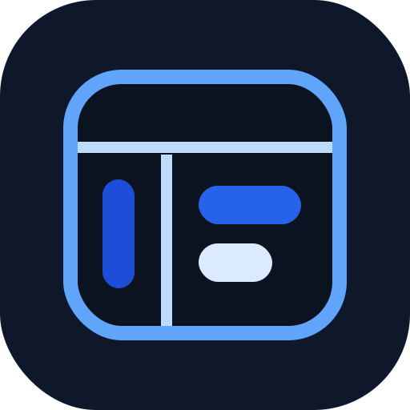
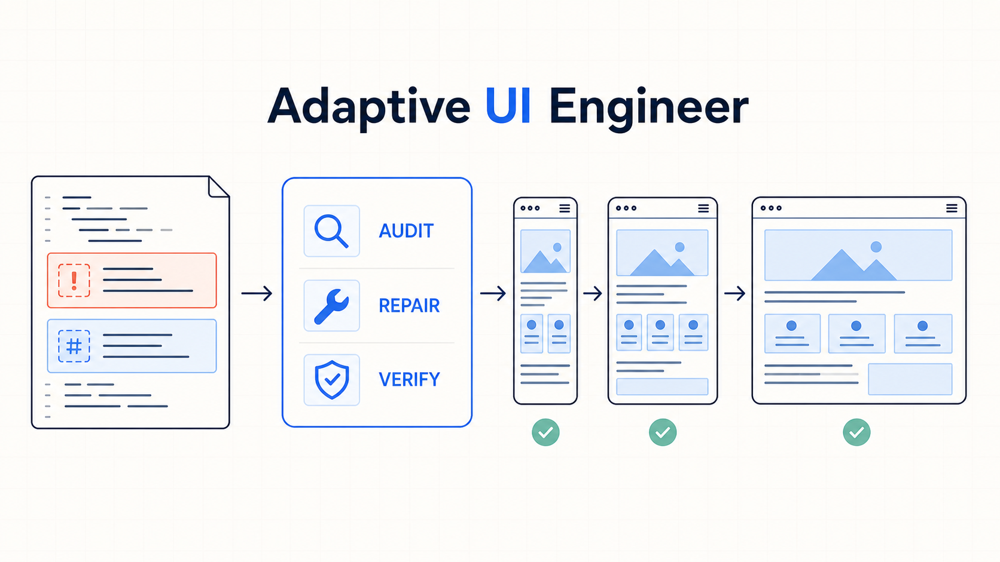

<p align="center">
  
</p>

# Adaptive UI Engineer

**A portable Agent Skill for auditing, simplifying, implementing, and verifying resilient responsive web interfaces.**

[简体中文](README.zh-CN.md) · [Agent Skills specification](https://agentskills.io/specification) · [Apache-2.0](LICENSE) · [Disclaimer](DISCLAIMER.md)

Adaptive UI Engineer turns responsive UI work into an evidence-based workflow. It covers layout reflow, overflow, viewport units, semantic radius systems, keyboard and touch interaction, accessibility settings, cross-browser fallbacks, and unnecessary JavaScript complexity. It does not generate a separate design for every screen resolution and does not hide defects behind global clipping.

<p align="center">
  
</p>

<p align="center"><sub>Audit the evidence, repair the root cause, and verify resilient reflow.</sub></p>

The repository contains one framework-agnostic Agent Skill and a thin Codex plugin wrapper. The Skill remains the single source of workflow truth.

## Why this exists

Common “responsive baselines” often mix good primitives with damaging global patches:

- `overflow-x: hidden` conceals the overflowing element and can clip focus or drawers.
- assigning 44px dimensions and padding to every link breaks inline prose;
- `pre, code { white-space: pre-wrap }` changes code semantics;
- `iframe { height: auto }` does not establish a useful embedded aspect ratio;
- more device breakpoints do not compensate for missing intrinsic layout;
- a static scan cannot prove browser behavior or WCAG conformance.

This Skill replaces those shortcuts with root-cause diagnosis, constrained implementation, and explicit verification evidence.

## Capabilities

- Audit-only, implementation, and verification modes derived from the user's authorization.
- Responsive layout review for containers, grid, flex, intrinsic sizing, overflow, zoom, media, tables, and viewport behavior.
- Semantic visual hierarchy with a reusable radius scale for controls, buttons, cards, panels, showcases, pills, and circles.
- Keyboard, focus, navigation, target-size, motion, forced-color, and text-spacing checks.
- JavaScript simplification: remove viewport-driven sizing, scroll interception, duplicate rendering, autoplay, stale listeners, and unnecessary state.
- Adapters for Vanilla HTML/CSS/JS, React/Next, Vue/Nuxt, SvelteKit, Tailwind, scoped CSS, CSS Modules, preprocessors, and CSS-in-JS.
- A zero-dependency Python auditor with stable rule IDs, confidence labels, suppressions, JSON output, and CI thresholds.
- Optional browser evidence when the host already provides browser control; no mandatory Playwright installation.

## Package layout

```text
.agents/plugins/marketplace.json
plugins/adaptive-ui-engineer/
├── .codex-plugin/plugin.json
├── assets/
└── skills/adaptive-ui-engineer/
    ├── SKILL.md
    ├── agents/openai.yaml
    ├── scripts/audit_ui.py
    ├── references/
    └── assets/
tests/
```

Human-facing project documentation stays at the repository root. The Skill directory contains only instructions and resources needed by an agent.

## Installation

### Any Agent Skills-compatible client

Install or copy this directory using the client's supported Skill mechanism:

```text
plugins/adaptive-ui-engineer/skills/adaptive-ui-engineer
```

For clients that scan `$HOME/.agents/skills`, copy it there.

PowerShell:

```powershell
Copy-Item -Recurse -Force `
  .\plugins\adaptive-ui-engineer\skills\adaptive-ui-engineer `
  "$HOME\.agents\skills\adaptive-ui-engineer"
```

macOS/Linux:

```sh
cp -R plugins/adaptive-ui-engineer/skills/adaptive-ui-engineer \
  "$HOME/.agents/skills/adaptive-ui-engineer"
```

Client discovery and invocation details vary. The portable core requires only `SKILL.md`; `agents/openai.yaml` is an optional Codex presentation extension.

### Codex plugin after the repository is published

```text
codex plugin marketplace add ksukie/adaptive-ui-engineer
codex plugin add adaptive-ui-engineer@adaptive-ui-engineer
```

For local plugin development, add the absolute repository directory as a non-default marketplace, then install the same plugin name. Start a new task after installation so the updated Skill is discovered.

No MCP server, connector, hook, account, or authentication is required.

## Use the Skill

Invoke it explicitly:

```text
Use $adaptive-ui-engineer to audit this page for responsive and accessibility issues. Do not edit files.
```

```text
Use $adaptive-ui-engineer to simplify this index page without changing the framework or sibling pages, then verify the result.
```

```text
Use $adaptive-ui-engineer to normalize the card radius hierarchy and remove viewport-driven layout JavaScript.
```

The description also supports implicit activation for responsive layout, overflow, viewport, radius, navigation, accessibility interaction, UI complexity, and browser compatibility tasks.

## Static auditor

The auditor is read-only unless `--output` is explicitly supplied.

```text
python plugins/adaptive-ui-engineer/skills/adaptive-ui-engineer/scripts/audit_ui.py <target>
  [--format text|json]
  [--config <file>]
  [--fail-on P0|P1|P2|P3|none]
  [--absolute-paths]
  [--redact-evidence]
  [--output <file>]
```

Examples:

```text
python plugins/adaptive-ui-engineer/skills/adaptive-ui-engineer/scripts/audit_ui.py ./src --format text --fail-on none
python plugins/adaptive-ui-engineer/skills/adaptive-ui-engineer/scripts/audit_ui.py ./src --format json --fail-on P1
python plugins/adaptive-ui-engineer/skills/adaptive-ui-engineer/scripts/audit_ui.py ./src --format json --redact-evidence --output audit.json
```

Exit codes:

| Code | Meaning |
| ---: | --- |
| 0 | Scan completed and the selected threshold was not breached |
| 1 | Scan completed and a finding met the selected threshold |
| 2 | Invalid input, configuration, or output operation |

JSON output uses `schema_version: 1`. Each finding includes `rule_id`, `priority`, `confidence`, `category`, `path`, `line`, `message`, `evidence`, and `recommendation`. Report metadata uses paths relative to the audit root by default; `--absolute-paths` is an explicit opt-in. Evidence can contain short source excerpts, so use `--redact-evidence` before sharing a report when source disclosure is not authorized.

### Configuration

Place `.adaptive-ui-engineer.json` at the audited root or pass `--config`:

```json
{
  "exclude": ["public/vendor/**", "legacy/generated/**"],
  "ignore": [
    {
      "rule": "AUI004",
      "paths": ["src/styles/full-bleed.css"],
      "reason": "The gallery background intentionally spans the visual viewport."
    }
  ],
  "fail_on": "P1"
}
```

The bundled schema is at `plugins/adaptive-ui-engineer/skills/adaptive-ui-engineer/assets/audit-config.schema.json`. Suppressions require a narrow path and a reason; they are counted in output.

## Design principles

- Target CSS constraints and content pressure, not physical device resolutions.
- Keep semantic DOM, reading order, visual order, and focus order aligned.
- Prefer intrinsic CSS and native behavior over JavaScript layout calculations.
- Repair the source of horizontal overflow rather than clipping the page.
- Use breakpoints only for genuine structural changes.
- Treat modern CSS as progressive enhancement when core content depends on it.
- Separate the WCAG 2.2 AA 24 CSS pixel target requirement and exceptions from the ergonomic 44px touch recommendation.
- Report tested evidence, static evidence, inference, and untested environments separately.

## Compatibility policy

### Designed baseline

| Environment | Policy |
| --- | --- |
| Chrome, Edge, Firefox | Current and previous two stable releases |
| Safari and iOS Safari | 16.4 and later |
| Chrome Android and Android WebView | Modern maintained releases |
| IE11 and Safari below 16.4 | Unsupported; core semantic degradation is still preferred |
| Python auditor | Python 3.9+ on Windows, macOS, and Linux |

### Evidence status for 0.1.0

- Locally validated on Windows with Python 3.9, 3.10, and 3.11.
- Unit tests and package checks cover cross-platform path behavior and are configured for Windows, macOS, Linux, and Python 3.9–3.13 in future CI.
- The package does not claim that a generated or audited website passes untested browsers, assistive technologies, or WCAG conformance.

## Development and validation

```text
python -m unittest discover -s tests -v
```

Open Agent Skills validation uses a fixed source commit, verifies the downloaded archive by SHA-256, and hash-locks every CI-only Python dependency. GitHub Actions are pinned to immutable commits. Codex authors should additionally run the current Skill Creator and Plugin Creator validators before release.

See [CONTRIBUTING.md](CONTRIBUTING.md), [SECURITY.md](SECURITY.md), [DISCLAIMER.md](DISCLAIMER.md), [RELEASE_CHECKLIST.md](RELEASE_CHECKLIST.md), and [CHANGELOG.md](CHANGELOG.md).

## Security and open-source posture

- The runtime auditor uses only the Python standard library. It does not execute scanned code, access the network, or install packages.
- Symbolic links and Windows reparse points inside the audit tree are skipped; a linked target or configuration is rejected. Local resource checks cannot escape the audit root.
- Reports are read-only by default. Explicit file output is written atomically and refuses a linked destination or linked parent path.
- Runtime users have no third-party Python dependencies. CI-only actions use immutable commit pins; the Agent Skills validator source archive and dependency graph are cryptographically locked.
- The repository includes an Apache-2.0 license, contribution terms, a private vulnerability-reporting path, automated security analysis, and a first-release checklist.

These controls are defense in depth, not a claim of formal penetration testing, legal review, WCAG certification, or security certification. Read the complete [security policy](SECURITY.md) before processing confidential source code.

## License

Apache License 2.0. See [LICENSE](LICENSE).

## Disclaimer

Read the complete [English disclaimer](DISCLAIMER.md) or [Simplified Chinese translation](DISCLAIMER.zh-CN.md). Adaptive UI Engineer is an independent community project. It is not affiliated with or endorsed by OpenAI, W3C, browser vendors, or the framework vendors named in this documentation. Product names and trademarks belong to their respective owners.
